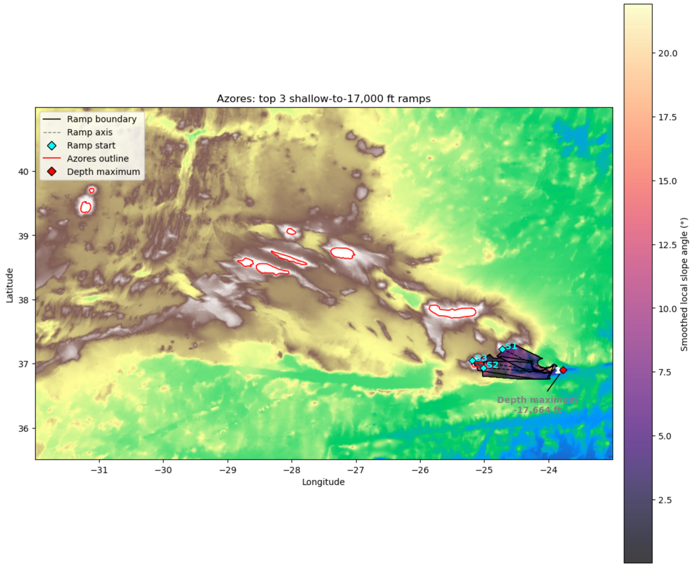
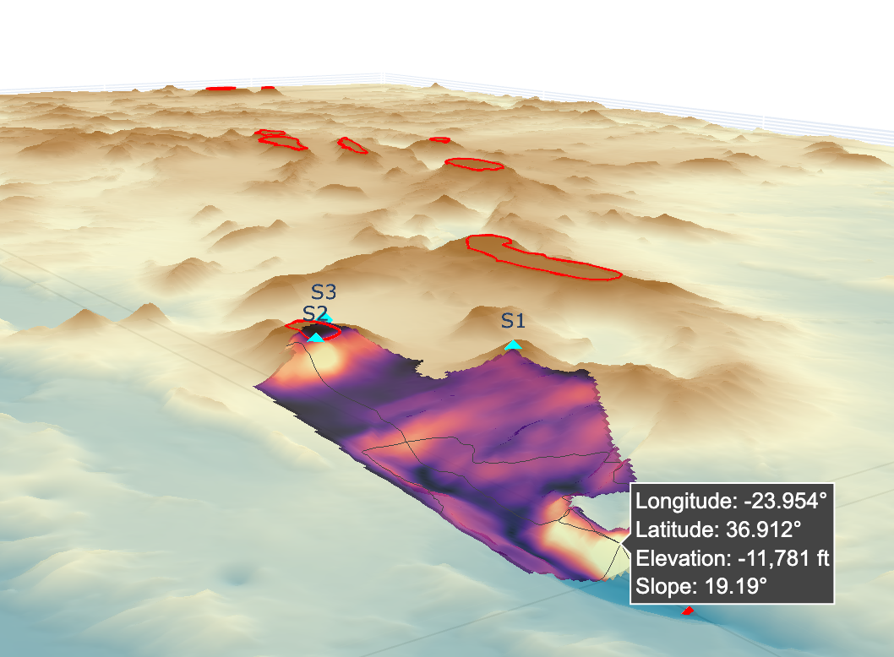
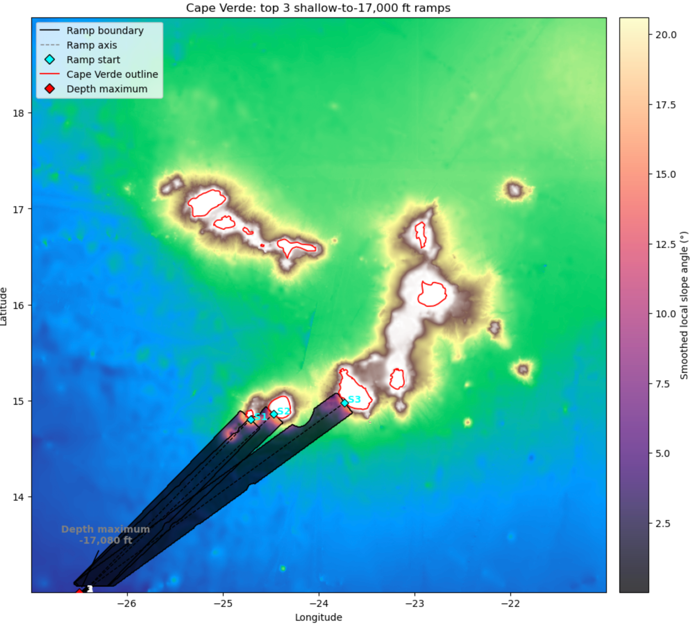
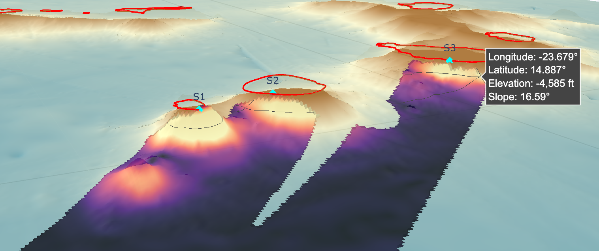
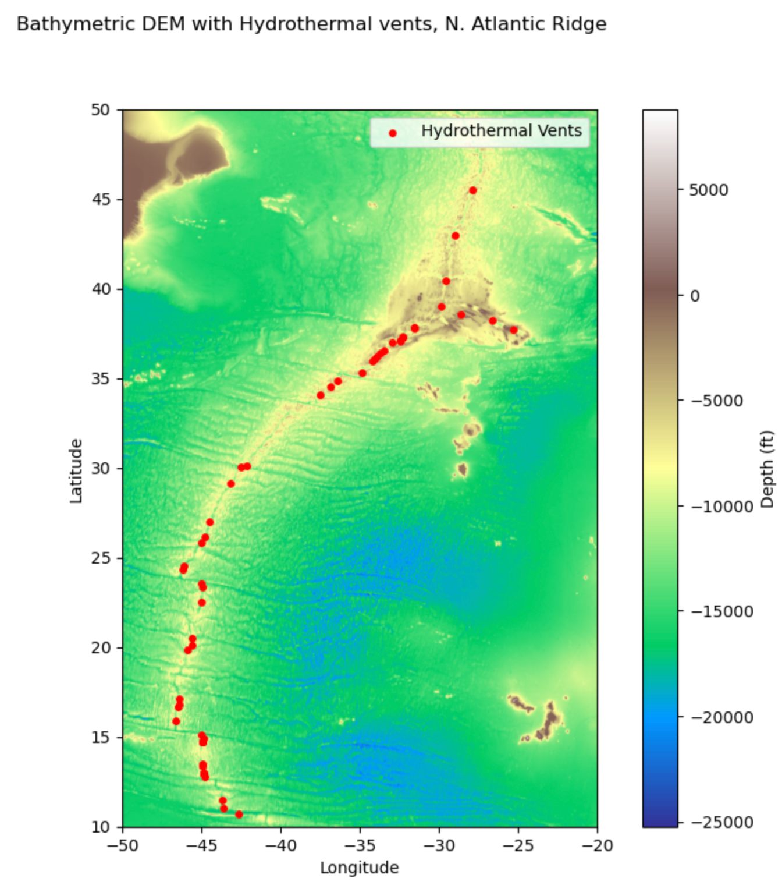
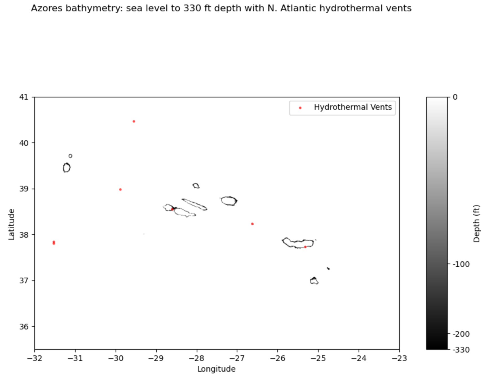

# Bathymetry Gradient Analysis

This project identifies abrupt shallow-to-deep bathymetric transitions in the GEBCO 2023 DEM. The initial study focuses on the Azores and Cape Verde because both combine exposed land with nearby abyssal depths, allowing steep transitions to be traced from approximately sea level rather than from an offshore continental shelf break.

The abyssal zone broadly occupies depths of about 10,000–20,000 ft ([Ocean Zones](https://www.researchgate.net/publication/275042652_Ocean_Zones)). The current analysis therefore uses -17,000 ft as its deep target, within the abyssal depth range.

The analysis is intended as a general method for locating unusually steep submarine slopes over short horizontal distances. Potential applications include identifying steep seafloor pathways associated with turbidity currents and other gravity flows, assessing bathymetric hazards to submarine cable routes ([Submarine Cable Map](https://www.submarinecablemap.com)), and supporting future fault or fracture mapping. The same approach could later be adapted to infrastructure-focused study areas, including submarine pipeline routes and regions such as the Norwegian Trench.

## Current workflow

1. Calculate geodetically corrected seafloor slope from the DEM.
2. Coarsen and smooth each region, then identify discrete shallow sources at sea level or within a 330 ft proxy tolerance for unresolved rocky outcrops.
3. Find the shortest route from each source to the -z ft contour, rank candidates by average slope, and retain the top three.
4. Expand each route into a continuous ramp surface using local downslope direction, slope support, and gap filling.
5. Plot ramp surfaces, start points, regional depth maxima, island outlines, and summary statistics in 2D Matplotlib and interactive 3D Plotly views.

InterRidge hydrothermal vent data is also loaded for regional comparison and continued work

**Data:** GEBCO 2023 bathymetry and InterRidge Hydrothermal Vents Database v3.4.

