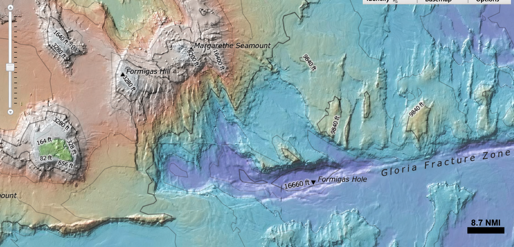

## Bathymetric gradient

The bathymetric gradient magnitude describes the rate of change of
seafloor elevation with horizontal distance:

$$
|\nabla z|
=
\sqrt{
\left(\frac{\partial z}{\partial x}\right)^2
+
\left(\frac{\partial z}{\partial y}\right)^2
}
$$

where $z$ is seafloor elevation and $x$ and $y$ are horizontal
coordinates.

The corresponding seafloor slope angle is:

$$
\theta
=
\tan^{-1}\left(|\nabla z|\right)
$$

or, in degrees,

$$
\theta_{\mathrm{deg}}
=
\frac{180}{\pi}
\tan^{-1}\left(|\nabla z|\right)
$$

     